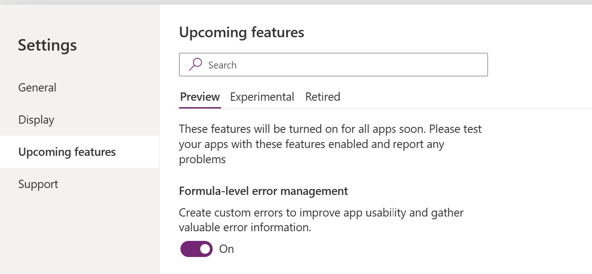

---
title: 
description: 
ms.date: 05/28/2024
ms.topic: conceptual
ms.service: power-platform
author: robstand
ms.author: rstand
manager: 
---

# Error Handling

Power Fx language has a new preview feature to enable Formula level error handling. This is by default turned On in the Settings.

This setting gives access to formulas like IfError, IsError, Error, and IsBlankorError. These functions allow users to detect errors, provide alternative values, or take specific actions based on the encountered error.

For details on Error Handling , please refer to the following article – [Error Handling in Canvas apps](https://learn.microsoft.com/en-us/power-platform/power-fx/error-handling)

### Validation Error Handling

Above functions can help with validating inputs such as Incorrect format or required fields. Use **If** statements or functions like **IsBlank** and **IsError** to validate user input. Provide clear error messages and prevent further processing until the input is corrected

If(

IsBlank(TextInput.Text),

Notify("Field cannot be blank", NotificationType.Error),

// Continue with processing

)

### Patch Function Error Handling

Similar to above example Error functions can help catch errors while Patching data to data source. Patch function reports errors in 2 ways:

-   It will return an error value as the result of the operations. Errors can be detected with IsError and replaced or suppressed with IfError.

### Forms Error Handling

When using Forms to submit data via SubmitForm function, using Form control property OnFailure to notify the error message

// OnSelect property of the form's submit button

SubmitForm(frm\_SubmitData);

// OnSuccess property of the form

Navigate('Success Screen');

// OnFailure property of the form

Notify(

"Error: the invoice could not be created",

NotificationType.Error

);

### Custom Error Message with OnError Property

Power Apps OnError is a property on your app which lets you capture all your unhandled errors. The OnError property gives you the ability to execute an expression that runs every time an error is not handled by the app (such as storing it in a variable or using a function such as IfError to replace it with some other value)." We can also point it to the official documentation for that property at <https://learn.microsoft.com/power-platform/power-fx/reference/object-app#onerror-property>. To use the **OnError **property, you need to add it to the app that you want to apply it to. Then, you can specify the error message that you want to display by writing a formula in the **OnError **property box.

It's important to note that **App.OnError** can't replace the error in the same way that **IfError** can. At the point that **App.OnError** is executed, the error has already happened, and the result has propagated through other formulas. **App.OnError** only controls how the error is reported to the end user and provides a hook for the maker to log the error if desired.

Following code on App.OnError can help locate the source of the error:

