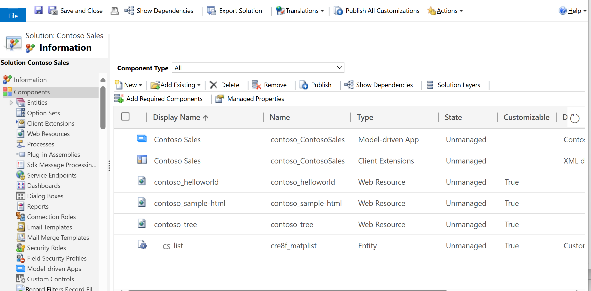

# Navigate to advanced model-driven app making and customization areas

This article describes how to access advanced customization and administration areas that are available within a Power Apps environment.

## Solutions

The [solutions](../model-driven-apps/model-driven-app-glossary.md#solution) area is where you can view, edit, create, import, export, and delete managed and unmanaged solutions.

1. Sign in to [Power Apps](https://make.powerapps.com/?utm_source=padocs&utm_medium=linkinadoc&utm_campaign=referralsfromdoc).
2. On the top right, select the [Environment](../model-driven-apps/model-driven-app-glossary.md#environment) where your solution is located.
3. On the left navigation pane, select **Solutions**. [!INCLUDE [left-navigation-pane](../../includes/left-navigation-pane.md)]
4. Select the solution you want.

   :::image type="content" source="../../maker/model-driven-apps/media/solution-assets-explorer.png" alt-text="Reviewing the solution explorer":::

## Solution explorer

Use classic solution explorer to perform app making and customization tasks that can’t be completed from the Power Apps website (make.powerapps.com).

1. From a Power Apps model-driven app, select **Settings**  on the app toolbar, and then select **Advanced settings**.

1. Select **Settings** > **Customizations**.
   :::image type="content" source="../../maker/model-driven-apps/media/settings-areas.png" alt-text="Accessing advanced settings":::

1. From the **Customization** area, select **Solutions**.
1. From the **All Solutions** view, select the **Display name** for the unmanaged solution you want to edit.

The solution explorer is displayed in a new browser window.
> [!div class="mx-imgBorder"]
> 

## Next steps

[Create or edit web resources in model-driven apps](create-edit-web-resources.md)

[!INCLUDE[footer-include](../../includes/footer-banner.md)]
